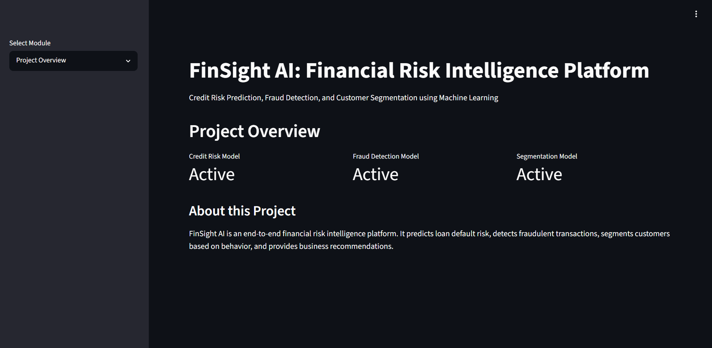
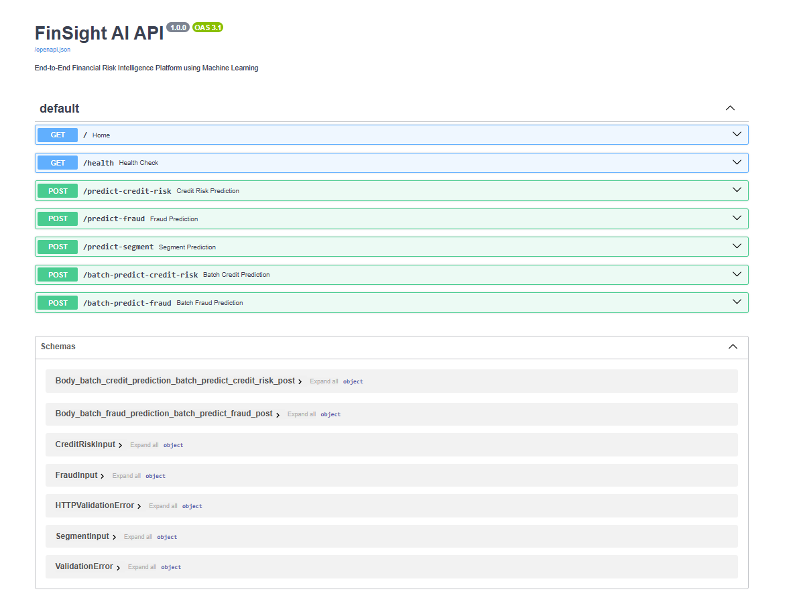

# FinSight AI: End-to-End Financial Risk Intelligence Platform

FinSight AI is a modular, Dockerized financial risk intelligence platform that predicts **credit default risk**, detects **fraudulent transactions**, performs **customer segmentation**, supports **batch CSV prediction**, and provides business recommendations through a **FastAPI backend** and **Streamlit dashboard**.

---

## Live Demo

**Streamlit Dashboard:**  
http://13.232.121.242:8501

**FastAPI Swagger Docs:**  
http://13.232.121.242:8000/docs

> Note: The live links work only when the AWS EC2 instance is running. If the instance is stopped/restarted without an Elastic IP, the public IP may change.

---

## Project Overview

Financial institutions process large volumes of loan applications, customer profiles, and transactions. Manual risk assessment is slow, difficult to scale, and inconsistent. FinSight AI uses machine learning to automate financial risk analysis and provide actionable business decisions.

The project contains three main modules:

1. **Credit Risk Prediction** - predicts whether a loan applicant may default.
2. **Fraud Detection** - detects potentially fraudulent transactions.
3. **Customer Segmentation** - groups customers based on transaction behavior.

The system supports both **single-record prediction** and **batch prediction using CSV upload**.

---

## Key Features

- Credit default risk prediction
- Fraud transaction detection
- Customer segmentation
- Business recommendation engine
- Batch CSV upload and prediction
- Downloadable prediction results
- FastAPI backend with Swagger documentation
- Streamlit interactive dashboard
- Dockerized multi-container setup
- AWS EC2 deployment
- Modular production-style code structure

---

## Tech Stack

| Category | Tools / Technologies |
|---|---|
| Programming Language | Python |
| Data Processing | Pandas, NumPy |
| Machine Learning | Scikit-learn |
| Backend API | FastAPI, Uvicorn |
| Frontend Dashboard | Streamlit |
| Model Serialization | Joblib / Pickle |
| Deployment | Docker, Docker Compose |
| Cloud | AWS EC2 |
| Version Control | Git, GitHub |

---

## Datasets Used

### 1. Credit Risk Module

**Dataset:** Home Credit Default Risk Dataset  
**Objective:** Predict whether a loan applicant may default.

Important features include contract type, gender, car ownership, realty ownership, income amount, credit amount, annuity amount, education type, family status, housing type, occupation type, employment days, and family members.

Engineered features:

```text
CREDIT_INCOME_RATIO
ANNUITY_INCOME_RATIO
CREDIT_TERM
DAYS_EMPLOYED_RATIO
```

### 2. Fraud Detection Module

**Dataset:** PaySim Fraud Detection Dataset  
**Objective:** Detect fraudulent financial transactions.

Important features include transaction type, amount, old origin balance, new origin balance, old destination balance, and new destination balance.

Engineered features:

```text
balance_diff_orig
balance_diff_dest
amount_balance_ratio
is_balance_drained
```

### 3. Customer Segmentation Module

**Objective:** Segment customers based on transaction behavior.

Features include total transactions, total amount, average amount, fraud ratio, balance behavior, and transaction type counts.

---

## System Architecture

```text
Datasets
   ↓
EDA + Data Preprocessing
   ↓
Feature Engineering
   ↓
ML Model Training
   ↓
Saved Model Artifacts
   ↓
FastAPI Backend
   ↓
Streamlit Dashboard
   ↓
Single Prediction + Batch Prediction
   ↓
Docker Deployment
   ↓
AWS EC2 Hosting
```

---

## Project Structure

```text
finsight-ai-financial-risk-platform/
│
├── app/
│   ├── __init__.py
│   ├── main.py
│   └── schema.py
│
├── dashboard/
│   ├── __init__.py
│   └── streamlit_app.py
│
├── data/
│   ├── sample_credit_input.csv
│   └── sample_fraud_input.csv
│
├── models/
│   ├── .gitkeep
│   ├── credit_risk_model.pkl
│   ├── fraud_detection_model.pkl
│   ├── customer_segmentation_model.pkl
│   ├── customer_segmentation_scaler.pkl
│   └── customer_segmentation_pca.pkl
│
├── notebooks/
│   ├── 01_home_credit_data_understanding.ipynb
│   ├── 02_paysim_data_understanding.ipynb
│   ├── 03_credit_risk_model_training.ipynb
│   ├── 04_fraud_detection_model_training.ipynb
│   └── 05_customer_segmentation.ipynb
│
├── src/
│   ├── __init__.py
│   ├── batch_predict.py
│   ├── config.py
│   ├── predict_credit.py
│   ├── predict_fraud.py
│   ├── predict_segment.py
│   ├── recommendations.py
│   └── utils.py
│
├── Dockerfile.api
├── Dockerfile.streamlit
├── docker-compose.yml
├── requirements-api.txt
├── requirements-streamlit.txt
├── requirements.txt
├── README.md
├── .gitignore
└── .dockerignore
```

---

## API Endpoints

| Method | Endpoint | Description |
|---|---|---|
| GET | `/` | API welcome route |
| GET | `/health` | Health check endpoint |
| POST | `/predict-credit-risk` | Single credit risk prediction |
| POST | `/predict-fraud` | Single fraud prediction |
| POST | `/predict-segment` | Customer segmentation prediction |
| POST | `/batch-predict-credit-risk` | Batch credit risk prediction from CSV |
| POST | `/batch-predict-fraud` | Batch fraud prediction from CSV |

---

## Run Locally Without Docker

### 1. Clone the repository

```bash
git clone https://github.com/Sh0hil/finsight-ai-financial-risk-platform.git
cd finsight-ai-financial-risk-platform
```

### 2. Create virtual environment

```bash
python -m venv venv
```

Activate it on Windows:

```bash
venv\Scripts\activate
```

Activate it on Linux/Mac:

```bash
source venv/bin/activate
```

### 3. Install dependencies

```bash
pip install -r requirements.txt
```

### 4. Run FastAPI backend

```bash
python -m uvicorn app.main:app --reload
```

Open:

```text
http://127.0.0.1:8000/docs
```

### 5. Run Streamlit dashboard

Open another terminal:

```bash
streamlit run dashboard/streamlit_app.py
```

Open:

```text
http://localhost:8501
```

---

## Run With Docker

Make sure Docker Desktop is running.

```bash
docker compose down
docker compose up --build
```

Open:

```text
FastAPI Docs: http://localhost:8000/docs
Streamlit UI:  http://localhost:8501
```

---

## Docker Compose Setup

```yaml
services:
  api:
    image: sh0hil/finsight-ai-api:latest
    container_name: finsight-api
    ports:
      - "8000:8000"
    restart: always

  streamlit:
    image: sh0hil/finsight-ai-streamlit:latest
    container_name: finsight-dashboard
    ports:
      - "8501:8501"
    environment:
      - API_URL=http://api:8000
    depends_on:
      - api
    restart: always
```

Inside Docker, Streamlit connects to FastAPI using:

```text
http://api:8000
```

because `api` is the Docker Compose service name.

---

## AWS EC2 Deployment

The project is deployed on an Ubuntu EC2 instance using Docker and Docker Compose.

### Recommended EC2 Setup

```text
OS: Ubuntu 22.04 LTS or Ubuntu 24.04 LTS
Storage: 30 GB minimum
RAM: 4 GB recommended
Ports: 22, 8000, 8501
```

For small EC2 instances, adding swap memory may be required:

```bash
sudo fallocate -l 4G /swapfile
sudo chmod 600 /swapfile
sudo mkswap /swapfile
sudo swapon /swapfile
echo '/swapfile none swap sw 0 0' | sudo tee -a /etc/fstab
```

### Deployment Commands

```bash
mkdir -p finsight-ai-deploy
cd finsight-ai-deploy
nano docker-compose.yml
```

Paste the Docker Compose configuration, then run:

```bash
docker compose pull
docker compose up -d
docker ps
```

Check API health:

```bash
curl http://localhost:8000/health
```

---

## Model Artifacts

Large model files are not pushed to GitHub because GitHub has a normal file size limit.

The `models/` folder is kept using `.gitkeep`, while actual `.pkl` model files should be available locally or included inside Docker images.

Ignored model files:

```gitignore
models/*.pkl
models/*.joblib
!models/.gitkeep
```

---

## Business Recommendations

The project returns predictions as well as practical business decisions.

### Credit Risk

| Risk Level | Decision |
|---|---|
| Low Risk | Approve |
| Medium Risk | Manual Review |
| High Risk | Reject / Manual Review Required |

### Fraud Detection

| Risk Level | Decision |
|---|---|
| Low Risk | Allow Transaction |
| Medium Risk | Step-up Authentication |
| High Risk | Manual Verification |
| Critical Risk | Block Transaction |

### Customer Segmentation

The system recommends actions such as premium offers, customer monitoring, engagement campaigns, and account safety reviews.

---

## Batch Prediction

The dashboard supports batch prediction using CSV upload.

Workflow:

```text
Upload CSV
   ↓
Select prediction type
   ↓
Choose number of rows
   ↓
Run batch prediction
   ↓
View results
   ↓
Download prediction CSV
```

This makes the project practical for real financial operations where many records need to be processed at once.

---

## Screenshots

Add screenshots in the `reports/screenshots/` folder.

Suggested screenshots:

```text
1. Streamlit dashboard overview
2. Credit risk prediction result
3. Fraud detection result
4. Customer segmentation result
5. Batch prediction result
6. FastAPI Swagger documentation
7. Docker containers running
8. AWS EC2 live deployment
```

Example:

```markdown


```

---

## Future Improvements

- Add user authentication
- Add database integration
- Store prediction history
- Add model monitoring
- Add automated retraining pipeline
- Add CI/CD deployment
- Use AWS S3 for model storage
- Add Nginx reverse proxy
- Add HTTPS with SSL certificate
- Use Elastic IP or custom domain
- Optimize model size
- Add explainability using SHAP or LIME

---

## Viva Explanation

**One-line explanation:**

FinSight AI is an end-to-end financial risk intelligence platform that predicts credit default risk, detects fraudulent transactions, segments customers, supports batch CSV prediction, and is deployed using FastAPI, Streamlit, Docker, and AWS EC2.

---

## Author

**Shohil Khan**  
B.Tech Computer Science and Engineering  
Machine Learning / Data Science Project

---

## Repository

GitHub Repository:  
https://github.com/Sh0hil/finsight-ai-financial-risk-platform

---

## License

This project is created for academic, learning, and portfolio purposes.
