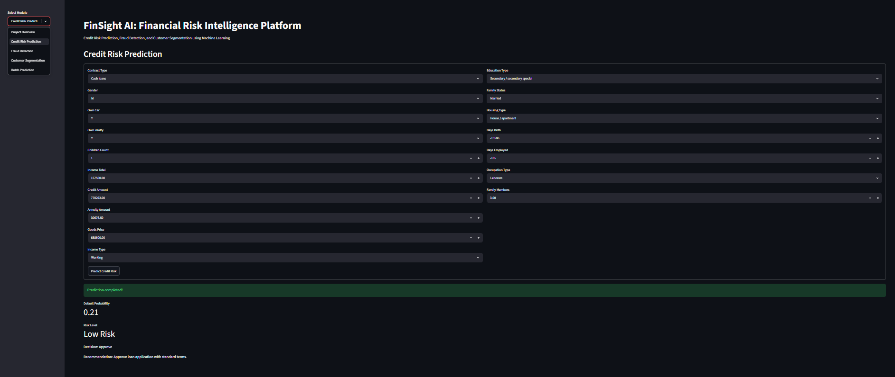
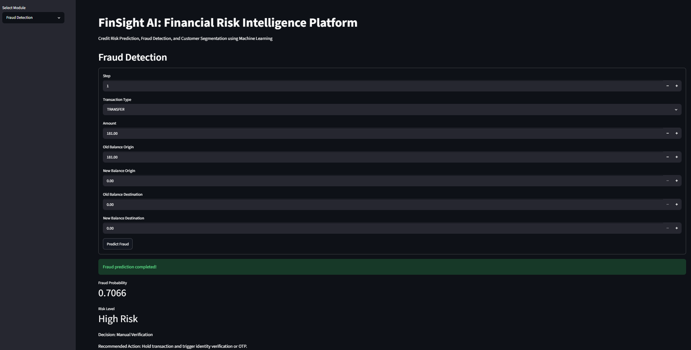
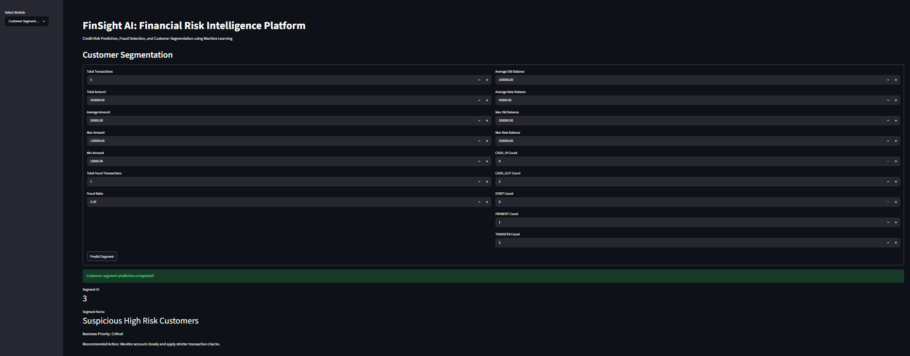
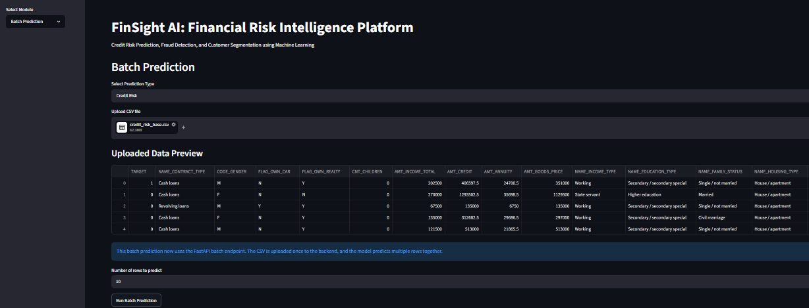
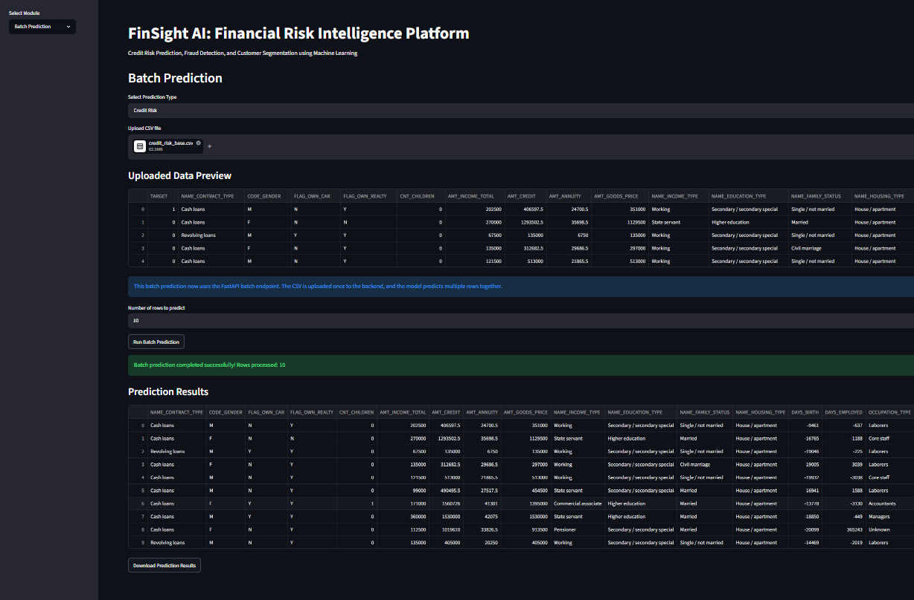
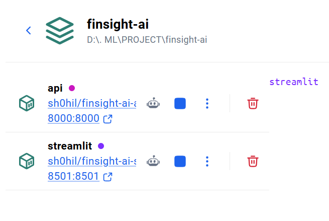
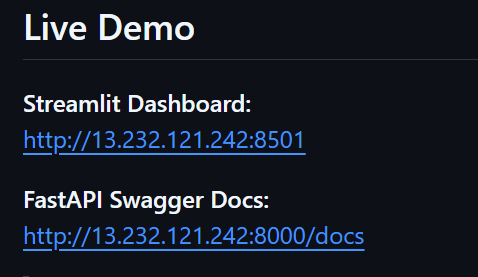

# FinSight AI: End-to-End Financial Risk Intelligence Platform

FinSight AI is a modular, Dockerized financial risk intelligence platform that predicts **credit default risk**, detects **fraudulent transactions**, performs **customer segmentation**, supports **batch CSV prediction**, and provides **business recommendations** through a **FastAPI backend** and **Streamlit dashboard**.

---

## Live Demo

**Streamlit Dashboard:**  
http://13.232.121.242:8501

**FastAPI Swagger Docs:**  
http://13.232.121.242:8000/docs

> Note: The live links work only when the AWS EC2 instance is running. If the instance is stopped or restarted without an Elastic IP, the public IP may change.

---

## Project Overview

Financial institutions process large volumes of loan applications, customer profiles, and transaction data every day. Manual risk assessment is slow, inconsistent, and difficult to scale.

FinSight AI solves this problem by using machine learning to automate financial risk analysis and convert predictions into actionable business recommendations.

The project contains four major functional areas:

1. **Credit Risk Prediction**  
   Predicts whether a loan applicant may default.

2. **Fraud Detection**  
   Detects potentially fraudulent transactions.

3. **Customer Segmentation**  
   Groups customers based on transaction behavior.

4. **Batch Prediction**  
   Allows users to upload CSV files and generate predictions for multiple records together.

---

## Key Features

- Credit default risk prediction
- Fraud transaction detection
- Customer segmentation
- Batch CSV upload and prediction
- Downloadable prediction results
- FastAPI batch prediction endpoints
- Streamlit interactive dashboard
- Business recommendation engine
- Dockerized multi-container deployment
- AWS EC2 cloud deployment
- Modular production-style code structure

---

## Tech Stack

| Category | Tools / Technologies |
|---|---|
| Programming Language | Python |
| Data Processing | Pandas, NumPy |
| Machine Learning | Scikit-learn |
| Backend API | FastAPI, Uvicorn |
| Frontend Dashboard | Streamlit |
| Model Serialization | Joblib / Pickle |
| Deployment | Docker, Docker Compose |
| Cloud | AWS EC2 |
| Version Control | Git, GitHub |
| Container Registry | Docker Hub |

---

## Datasets Used

### 1. Credit Risk Module

**Dataset:** Home Credit Default Risk Dataset  
**Objective:** Predict whether a loan applicant is likely to default.

Important features include:

- Contract type
- Gender
- Car ownership
- Realty ownership
- Income amount
- Credit amount
- Annuity amount
- Goods price
- Income type
- Education type
- Family status
- Housing type
- Occupation type
- Employment days
- Family members

Engineered features:

```text
CREDIT_INCOME_RATIO
ANNUITY_INCOME_RATIO
CREDIT_TERM
DAYS_EMPLOYED_RATIO
```

---

### 2. Fraud Detection Module

**Dataset:** PaySim Fraud Detection Dataset  
**Objective:** Detect fraudulent financial transactions.

Important features include:

- Transaction step
- Transaction type
- Transaction amount
- Old origin balance
- New origin balance
- Old destination balance
- New destination balance

Engineered features:

```text
balance_diff_orig
balance_diff_dest
amount_balance_ratio
is_balance_drained
```

---

### 3. Customer Segmentation Module

**Objective:** Segment customers based on transaction behavior.

Features include:

- Total transactions
- Total transaction amount
- Average transaction amount
- Maximum transaction amount
- Minimum transaction amount
- Fraud ratio
- Balance behavior
- Transaction type counts

---

## System Architecture

```text
Datasets
   ↓
EDA + Data Preprocessing
   ↓
Feature Engineering
   ↓
ML Model Training
   ↓
Saved Model Artifacts
   ↓
FastAPI Backend
   ↓
Streamlit Dashboard
   ↓
Single Prediction + Batch Prediction
   ↓
Docker Deployment
   ↓
AWS EC2 Hosting
```

---

## Batch Prediction Module

The batch prediction module is one of the most practical parts of this project. Instead of entering one record at a time, users can upload a CSV file and generate predictions for multiple records together.

### Batch Prediction Workflow

```text
Select Batch Prediction Module
   ↓
Choose Prediction Type
   ↓
Upload CSV File
   ↓
Preview Uploaded Data
   ↓
Select Number of Rows to Predict
   ↓
Run Batch Prediction
   ↓
View Prediction Results
   ↓
Download Final Prediction CSV
```

### Batch Prediction Features

- CSV file upload from Streamlit dashboard
- Uploaded data preview before prediction
- User-controlled row limit for faster testing
- FastAPI batch endpoint integration
- Multiple records predicted together
- Prediction results shown in tabular format
- Downloadable output CSV
- Supports credit risk batch prediction
- Supports fraud detection batch prediction

### Batch Prediction Architecture

```text
Streamlit CSV Upload
        ↓
FastAPI Batch Endpoint
        ↓
Data Cleaning + Feature Engineering
        ↓
Saved ML Model
        ↓
Prediction + Probability
        ↓
Business Recommendation
        ↓
Results Returned to Dashboard
        ↓
Downloadable CSV
```

### Batch API Endpoints

| Endpoint | Purpose |
|---|---|
| `/batch-predict-credit-risk` | Predicts credit risk for multiple applicants using uploaded CSV |
| `/batch-predict-fraud` | Predicts fraud risk for multiple transactions using uploaded CSV |

### Why Batch Prediction Is Important

Batch prediction makes the project more realistic for financial companies because banks, NBFCs, fintech companies, and fraud monitoring teams usually process thousands of records together instead of one record at a time.

This feature makes the project suitable for real business use cases such as:

- Bulk loan application screening
- Transaction fraud monitoring
- Risk report generation
- Internal financial analytics
- Automated decision-support systems

---

## Streamlit Dashboard Modules

The Streamlit dashboard contains the following modules:

```text
Project Overview
Credit Risk Prediction
Fraud Detection
Customer Segmentation
Batch Prediction
```

### 1. Project Overview

Provides a high-level summary of the project, modules, and system purpose.

### 2. Credit Risk Prediction

Allows single applicant-level prediction using credit risk features.

Output includes:

- Prediction label
- Default probability
- Risk level
- Decision
- Recommendation

### 3. Fraud Detection

Allows single transaction-level fraud prediction.

Output includes:

- Prediction label
- Fraud probability
- Risk level
- Decision
- Recommended action

### 4. Customer Segmentation

Segments customers based on financial and transaction behavior.

Output includes:

- Segment ID
- Segment name
- PCA values
- Business priority
- Recommended segment action

### 5. Batch Prediction

Allows CSV upload for multiple-record prediction.

Output includes:

- Uploaded data preview
- Processed prediction results
- Risk probability
- Decision
- Recommendation
- Downloadable CSV result

---

## Project Structure

```text
finsight-ai-financial-risk-platform/
│
├── app/
│   ├── __init__.py
│   ├── main.py
│   └── schema.py
│
├── dashboard/
│   ├── __init__.py
│   └── streamlit_app.py
│
├── data/
│   ├── sample_credit_input.csv
│   └── sample_fraud_input.csv
│
├── models/
│   ├── .gitkeep
│   ├── credit_risk_model.pkl
│   ├── fraud_detection_model.pkl
│   ├── customer_segmentation_model.pkl
│   ├── customer_segmentation_scaler.pkl
│   └── customer_segmentation_pca.pkl
│
├── notebooks/
│   ├── 01_home_credit_data_understanding.ipynb
│   ├── 02_paysim_data_understanding.ipynb
│   ├── 03_credit_risk_model_training.ipynb
│   ├── 04_fraud_detection_model_training.ipynb
│   └── 05_customer_segmentation.ipynb
│
├── src/
│   ├── __init__.py
│   ├── batch_predict.py
│   ├── config.py
│   ├── predict_credit.py
│   ├── predict_fraud.py
│   ├── predict_segment.py
│   ├── recommendations.py
│   └── utils.py
│
├── Dockerfile.api
├── Dockerfile.streamlit
├── docker-compose.yml
├── requirements-api.txt
├── requirements-streamlit.txt
├── requirements.txt
├── README.md
├── .gitignore
└── .dockerignore
```

---

## API Endpoints

| Method | Endpoint | Description |
|---|---|---|
| GET | `/` | API welcome route |
| GET | `/health` | Health check endpoint |
| POST | `/predict-credit-risk` | Single credit risk prediction |
| POST | `/predict-fraud` | Single fraud prediction |
| POST | `/predict-segment` | Customer segmentation prediction |
| POST | `/batch-predict-credit-risk` | Batch credit risk prediction from CSV |
| POST | `/batch-predict-fraud` | Batch fraud prediction from CSV |

---

## Business Recommendation Engine

The project does not only return raw model predictions. It also converts model outputs into business-friendly recommendations.

### Credit Risk Decisions

| Risk Level | Decision |
|---|---|
| Low Risk | Approve |
| Medium Risk | Manual Review |
| High Risk | Reject / Manual Review Required |

### Fraud Detection Decisions

| Risk Level | Decision |
|---|---|
| Low Risk | Allow Transaction |
| Medium Risk | Step-up Authentication |
| High Risk | Manual Verification |
| Critical Risk | Block Transaction |

### Customer Segmentation Actions

The segmentation module recommends actions such as:

- Offer premium products
- Monitor suspicious customers
- Send engagement campaigns
- Trigger account safety review
- Continue normal monitoring

---

## Run Locally Without Docker

### 1. Clone the Repository

```bash
git clone https://github.com/Sh0hil/finsight-ai-financial-risk-platform.git
cd finsight-ai-financial-risk-platform
```

### 2. Create Virtual Environment

```bash
python -m venv venv
```

Activate it on Windows:

```bash
venv\Scripts\activate
```

Activate it on Linux/Mac:

```bash
source venv/bin/activate
```

### 3. Install Dependencies

```bash
pip install -r requirements.txt
```

### 4. Run FastAPI Backend

```bash
python -m uvicorn app.main:app --reload
```

Open:

```text
http://127.0.0.1:8000/docs
```

### 5. Run Streamlit Dashboard

Open another terminal:

```bash
streamlit run dashboard/streamlit_app.py
```

Open:

```text
http://localhost:8501
```

---

## Run With Docker

Make sure Docker Desktop is running.

```bash
docker compose down
docker compose up --build
```

Open:

```text
FastAPI Docs: http://localhost:8000/docs
Streamlit UI:  http://localhost:8501
```

---

## Docker Compose Setup

```yaml
services:
  api:
    image: sh0hil/finsight-ai-api:latest
    container_name: finsight-api
    ports:
      - "8000:8000"
    restart: always

  streamlit:
    image: sh0hil/finsight-ai-streamlit:latest
    container_name: finsight-dashboard
    ports:
      - "8501:8501"
    environment:
      - API_URL=http://api:8000
    depends_on:
      - api
    restart: always
```

Inside Docker, Streamlit connects to FastAPI using:

```text
http://api:8000
```

because `api` is the Docker Compose service name.

---

## AWS EC2 Deployment

The project is deployed on an Ubuntu EC2 instance using Docker and Docker Compose.

### Recommended EC2 Setup

```text
OS: Ubuntu 22.04 LTS or Ubuntu 24.04 LTS
Storage: 30 GB minimum
RAM: 4 GB recommended
Ports: 22, 8000, 8501
```

For small EC2 instances, adding swap memory may be required:

```bash
sudo fallocate -l 4G /swapfile
sudo chmod 600 /swapfile
sudo mkswap /swapfile
sudo swapon /swapfile
echo '/swapfile none swap sw 0 0' | sudo tee -a /etc/fstab
```

### Deployment Commands

```bash
mkdir -p finsight-ai-deploy
cd finsight-ai-deploy
nano docker-compose.yml
```

Paste the Docker Compose configuration, then run:

```bash
docker compose pull
docker compose up -d
docker ps
```

Check API health:

```bash
curl http://localhost:8000/health
```

---

## Model Artifacts

Large model files are not pushed to GitHub because GitHub has a normal file size limit.

The `models/` folder is kept using `.gitkeep`, while actual `.pkl` model files should be available locally or included inside Docker images.

Ignored model files:

```gitignore
models/*.pkl
models/*.joblib
!models/.gitkeep
```

---

## Screenshots

Add screenshots in the `reports/screenshots/` folder.

Suggested screenshots:

```text
1. Streamlit dashboard overview
2. Credit risk prediction result
3. Fraud detection result
4. Customer segmentation result
5. Batch prediction uploaded data preview
6. Batch prediction final result table
7. FastAPI Swagger documentation
8. Docker containers running
9. AWS EC2 live deployment
```

Example Markdown:

```markdown
---

## Project Screenshots

### Streamlit Dashboard


### Credit Risk Prediction



### Fraud Detection



### Customer Segmentation



### Batch Prediction - Uploaded Data Preview



### Batch Prediction - Final Results



### FastAPI Swagger Documentation


### Docker Containers Running



### AWS EC2 Live Deployment


```

---

## Results

The platform successfully provides:

- Credit default prediction
- Fraud prediction
- Customer segment prediction
- Prediction probability
- Risk level
- Business decision
- Recommended action
- Batch CSV prediction
- Downloadable prediction results
- Cloud-hosted dashboard and API

---

## Future Improvements

- Add user authentication
- Add database integration
- Store prediction history
- Add model monitoring
- Add automated retraining pipeline
- Add CI/CD deployment
- Use AWS S3 for model storage
- Add Nginx reverse proxy
- Add HTTPS with SSL certificate
- Use Elastic IP or custom domain
- Optimize model size
- Add explainability using SHAP or LIME

---

## Viva Explanation

**One-line explanation:**

FinSight AI is an end-to-end financial risk intelligence platform that predicts credit default risk, detects fraudulent transactions, segments customers, supports batch CSV prediction, and is deployed using FastAPI, Streamlit, Docker, and AWS EC2.

---

## Author

**Shohil Khan**  
B.Tech Computer Science and Engineering  
Machine Learning / Data Science Project

---

## Repository

GitHub Repository:  
https://github.com/Sh0hil/finsight-ai-financial-risk-platform

---

## License

This project is created for academic, learning, and portfolio purposes.
